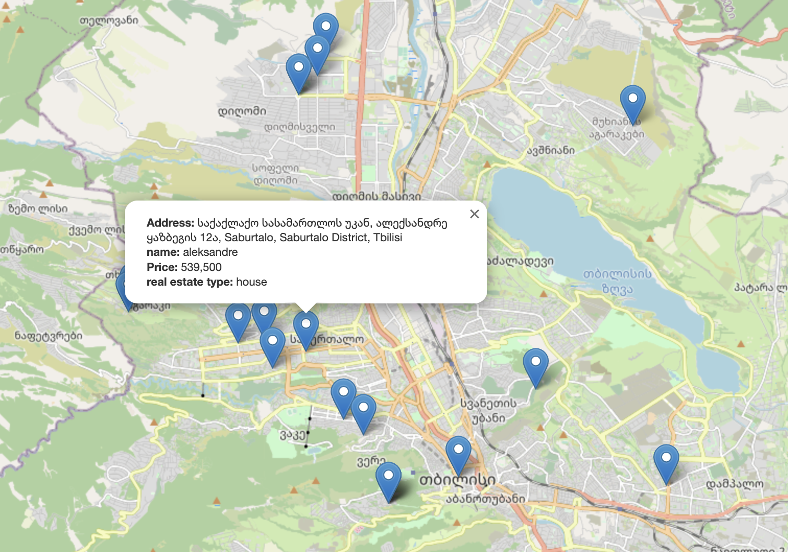

# real-estate

## Visualisation of the gathered data in a creative form

## url to see dynamodb data on s3 
http://realestatedata123.s3-website-us-east-1.amazonaws.com/data.txt

## map link
http://realestatedata123.s3-website-us-east-1.amazonaws.com/map.html

## tools used
- AWS dynamodb
- AWS s3
- python
- folium - data visualization

## cron is scheduled to execute the specified command at midnight (00:00) every day, regardless of the day of the week or month.